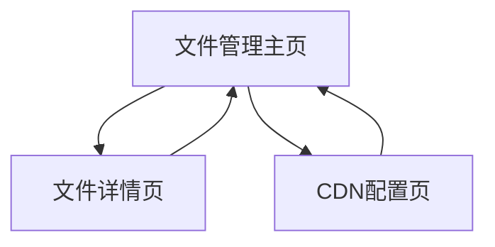

# FTP-CDN系统产品需求文档

## 1. 产品概述

一个基于Java的FTP文件上传与CDN路径管理系统，支持文件自动重命名、FTP存储和数据库记录管理。

* 解决文件上传后需要可访问URL地址的问题，为用户提供类似CDN的文件托管服务

* 面向需要快速搭建文件存储服务的开发者和小型团队

* 通过自定义前缀路径实现灵活的CDN域名配置，提升文件访问体验

## 2. 核心功能

### 2.1 用户角色

| 角色   | 注册方式 | 核心权限                 |
| ---- | ---- | -------------------- |
| 默认用户 | 无需注册 | 可上传文件、管理CDN前缀、查看文件列表 |

### 2.2 功能模块

本系统包含以下核心页面：

1. **文件管理主页**：文件上传区域、CDN前缀配置、文件列表展示
2. **文件详情页**：单个文件的详细信息和操作选项
3. **CDN配置页**：管理和添加自定义CDN前缀路径

### 2.3 页面详情

| 页面名称   | 模块名称     | 功能描述                                        |
| ------ | -------- | ------------------------------------------- |
| 文件管理主页 | 文件上传模块   | 选择文件、选择CDN前缀、执行上传。自动生成UUID+时间戳文件名，上传至FTP服务器 |
| 文件管理主页 | CDN前缀选择器 | 下拉选择已配置的CDN前缀，支持快速切换不同域名                    |
| 文件管理主页 | 文件列表模块   | 分页显示已上传文件，包含原文件名、生成文件名、CDN完整路径、描述、上传时间      |
| 文件管理主页 | 搜索过滤模块   | 按原文件名、描述进行模糊搜索，实时过滤文件列表                     |
| 文件详情页  | 文件信息展示   | 显示文件完整信息、预览链接、下载统计                          |
| 文件详情页  | 文件操作模块   | 复制CDN链接、编辑描述、删除文件                           |
| CDN配置页 | 前缀管理模块   | 添加、编辑、删除CDN前缀配置，设置默认前缀                      |

## 3. 核心流程

**文件上传流程：**
用户选择文件 → 选择CDN前缀 → 填写描述 → 系统生成UUID+时间戳文件名 → 上传至FTP服务器 → 保存记录到MySQL数据库 → 返回完整CDN访问路径

**文件管理流程：**
用户访问主页 → 查看文件列表（支持分页和搜索） → 点击文件查看详情 → 复制CDN链接或进行其他操作

## 4. 用户界面设计

### 4.1 设计风格

* 主色调：#2563eb（蓝色），辅助色：#f8fafc（浅灰）

* 按钮样式：圆角设计，悬停效果，现代扁平化风格

* 字体：系统默认字体，标题16px，正文14px，小字12px

* 布局风格：卡片式布局，顶部导航栏，响应式设计

* 图标风格：使用简洁的线性图标，支持文件类型识别

### 4.2 页面设计概览

| 页面名称   | 模块名称   | UI元素                                   |
| ------ | ------ | -------------------------------------- |
| 文件管理主页 | 文件上传模块 | 拖拽上传区域，蓝色边框，虚线样式。CDN前缀下拉选择器，描述输入框，上传按钮 |
| 文件管理主页 | 文件列表模块 | 表格布局，斑马纹行，悬停高亮。分页组件底部居中，搜索框右上角         |
| 文件详情页  | 文件信息展示 | 卡片式信息展示，文件图标，复制按钮带动画效果                 |
| CDN配置页 | 前缀管理模块 | 表单式布局，添加按钮醒目，列表展                       |

